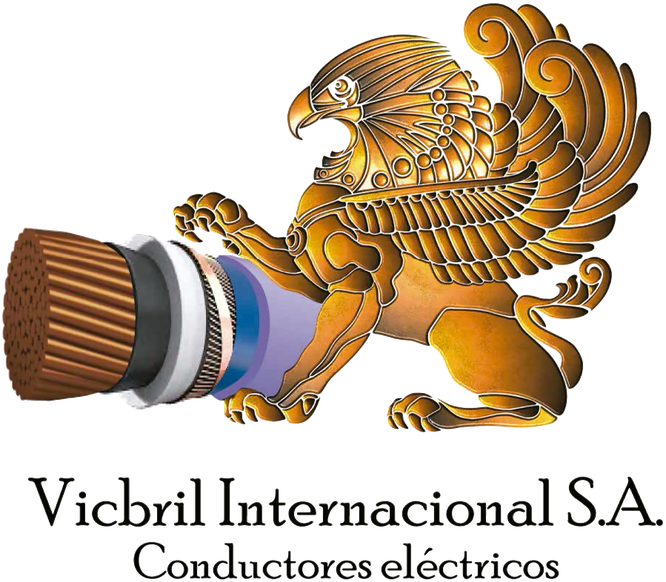

<div align="center">
  

  # Vicbril Internacional S.A.
  ### Distribuidor Mayorista de Conductores Eléctricos de Alta Calidad

  [](https://react.dev/)
  [](https://www.typescriptlang.org/)
  [](https://vitejs.dev/)
  [](https://tailwindcss.com/)
</div>

---

## ⚡ Acerca del Proyecto

**Vicbril Internacional S.A.** es una plataforma web moderna e interactiva diseñada para la exhibición y cotización de conductores eléctricos y cables especiales. Con más de 25 años de trayectoria en el mercado eléctrico argentino, esta plataforma permite a constructoras, ingenieros y distribuidores explorar un catálogo completo y solicitar cotizaciones personalizadas de forma rápida.

---

## 🚀 Características Principales

* 📂 **Catálogo de Productos Inteligente**: Filtros dinámicos por categorías, subcategorías y materiales (Cobre/Aluminio).
* ⚙️ **Fichas Técnicas Interactivas**: Tablas detalladas con formaciones, calibres, diámetros, peso y ampacidad, con soporte de desplazamiento responsivo para dispositivos móviles.
* 📈 **Página de Mercados dedicada**: Sección interactiva de sectores que abastecemos (Oil & Gas, Minería, Energía, Infraestructura y Construcción) con efectos de revelación visual premium.
* 💬 **Integración con WhatsApp**: Cotización en un solo clic con mensajes pre-formateados que incluyen los datos del producto consultado.
* 🎯 **Optimización de PageSpeed**: Imágenes completamente comprimidas (reducción de más de 80 MB) y optimizadas para cargas ultrarrápidas, asegurando un rendimiento de excelencia en redes móviles.
* 📱 **Diseño 100% Responsivo**: Adaptado y verificado de punta a punta, desde teléfonos compactos hasta pantallas ultrapanorámicas.

---

## 🛠️ Tecnologías Utilizadas

* **Framework Core**: React 19 & TypeScript 5
* **Herramienta de Construcción**: Vite 6
* **Estilado & Diseño**: Tailwind CSS (con configuraciones personalizadas en CDN) & Vanilla CSS
* **Iconografía**: Lucide React
* **Procesamiento de Assets**: Python (Pillow) para la compresión de imágenes sin pérdida de resolución.

---

## 💻 Desarrollo Local

### Prerrequisitos
Tener instalado [Node.js](https://nodejs.org/) (versión 18 o superior recomendada).

### Pasos para iniciar

1. **Clonar el repositorio**:
   ```bash
   git clone <url-del-repositorio>
   cd vicbril-internacional
   ```

2. **Instalar las dependencias**:
   ```bash
   npm install
   ```

3. **Iniciar el servidor de desarrollo**:
   ```bash
   npm run dev
   ```
   El sitio estará disponible localmente en [http://localhost:3000/](http://localhost:3000/).

4. **Compilar para producción**:
   ```bash
   npm run build
   ```
   Los archivos listos para producción se generarán en la carpeta `/dist`.

---

## 🏢 Arquitectura de Carpetas

```
├── components/          # Componentes de UI y Maquetación (Header, Footer, etc.)
├── pages/               # Vistas de la aplicación (Home, Nosotros, Catálogo, Mercados, etc.)
├── public/              # Archivos estáticos y multimedia (imágenes optimizadas)
├── services/            # Base de datos estática de cables, hooks y llamadas API
├── App.tsx              # Componente raíz y enrutador de la aplicación
├── index.html           # Plantilla HTML con configuraciones CDN y tipografías
└── index.css            # Hoja de estilos global y animaciones a medida
```

---

<div align="center">
  <p>Desarrollado con ❤️ para <b>Vicbril Internacional S.A.</b></p>
</div>
